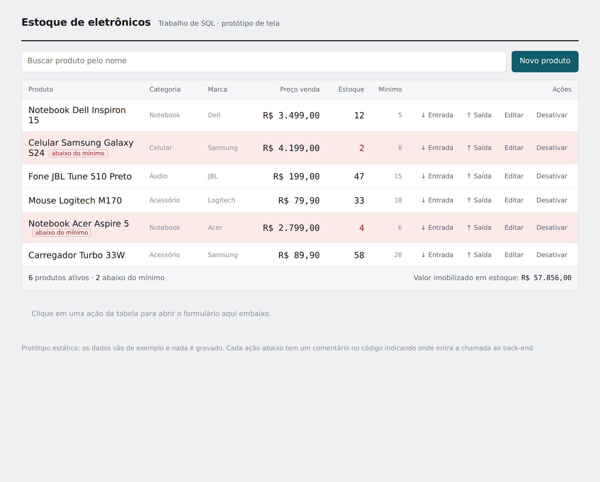
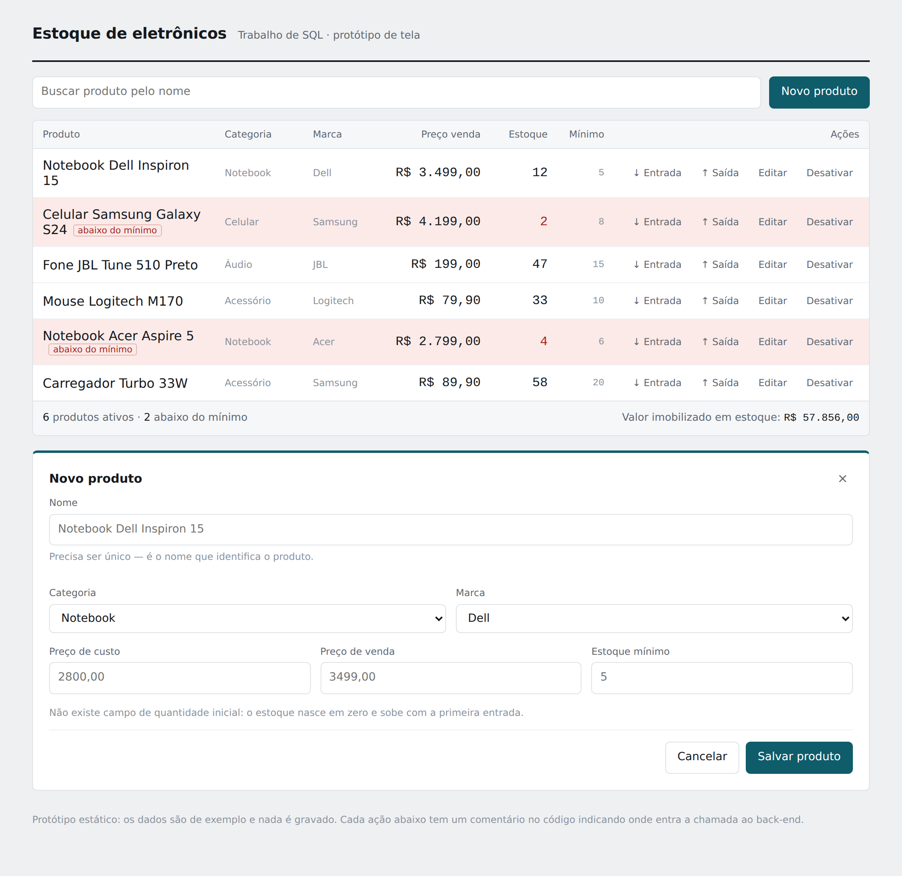
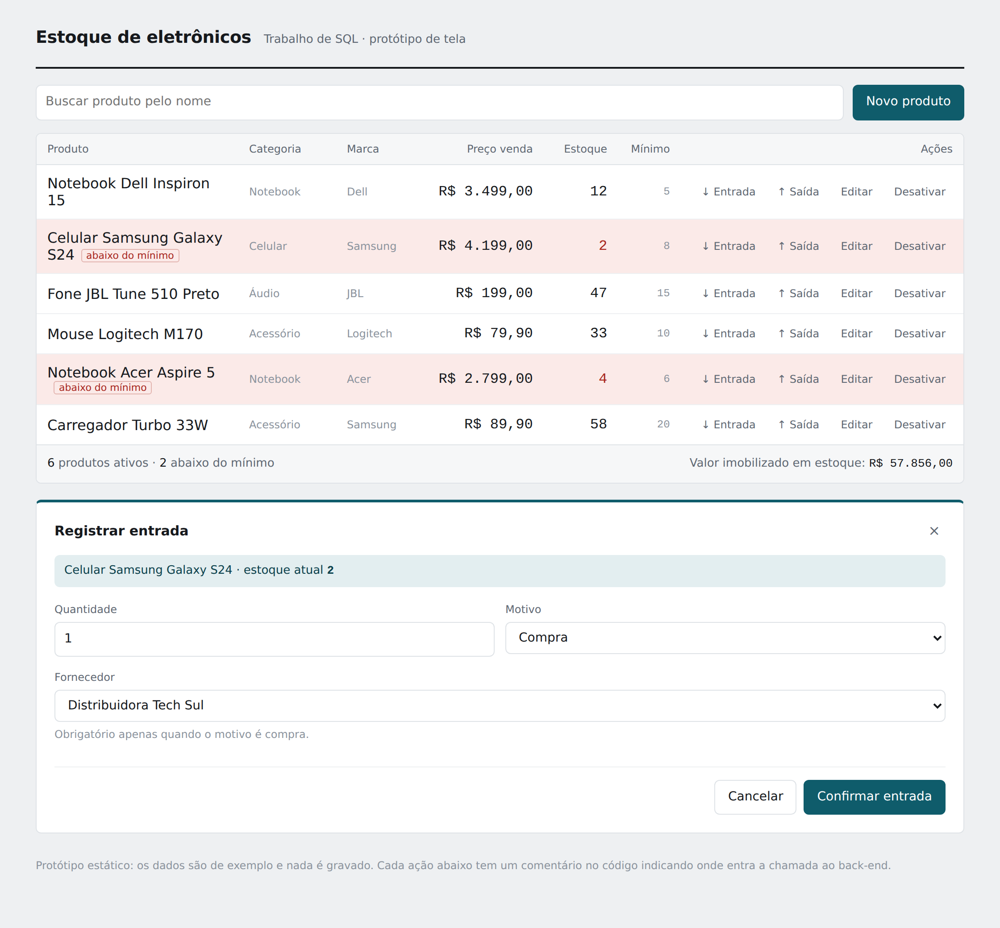
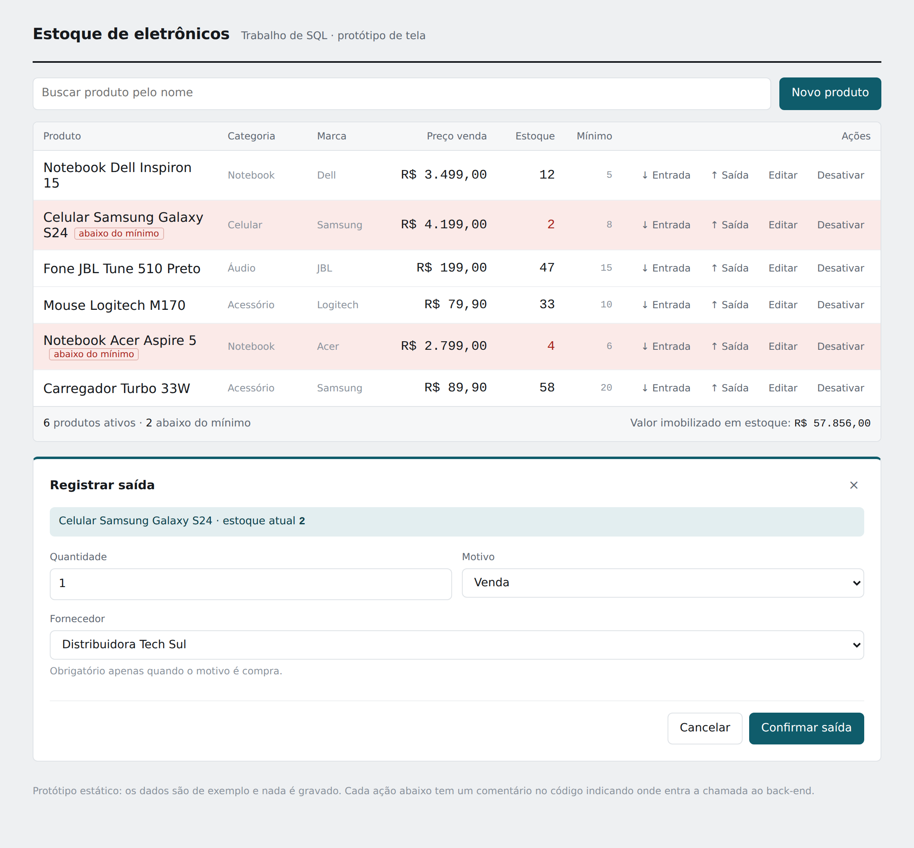

# Trabalho de SQL — CRUD de Estoque de Eletrônicos

**Estado do projeto** · atualizado conforme as decisões são fechadas

---

## 1. Contexto

- Trabalho valendo metade da nota da primeira prova
- Prazo: 1 semana
- Foco da avaliação: **qualidade do SQL**
- Front em HTML/CSS, back **sem framework**
- Tela única para todas as operações

**Divisão:** eu no back-end (Python + SQL Server) · minha amiga no front · o restante do grupo na documentação

---

## 2. Stack

| Camada | Escolha |
|---|---|
| Banco | SQL Server |
| Back | Python sem framework (pyodbc) |
| Front | HTML + CSS + JavaScript |
| Comunicação | JSON |

---

## 3. Decisão central de modelagem

**O produto não tem coluna de quantidade.**

Cada entrada e cada saída é uma linha nova na tabela `movimentacao`. O estoque atual é a **soma** dessas linhas, exposta por uma view.

Analogia de defesa: extrato bancário — o saldo não é digitado, é resultado do que entrou e saiu.

Ganhos: histórico completo, auditoria, agregações, transação real, consultas ricas.

---

## 4. Tabelas

### categoria
| Campo | Observação |
|---|---|
| id | PK |
| nome | UNIQUE |

### marca
| Campo | Observação |
|---|---|
| id | PK |
| nome | UNIQUE |

### fornecedor
| Campo | Observação |
|---|---|
| id | PK |
| nome | obrigatório |
| cnpj | UNIQUE |
| telefone | |
| email | |

### produto
| Campo | Observação |
|---|---|
| id | PK |
| nome | **UNIQUE** (substitui o SKU) |
| categoria_id | FK → categoria |
| marca_id | FK → marca |
| preco_custo | |
| preco_venda | |
| estoque_minimo | |
| ativo | soft delete (1/0) |

### movimentacao
| Campo | Observação |
|---|---|
| id | PK |
| produto_id | FK → produto |
| tipo | 'E' ou 'S' |
| quantidade | sempre positiva, CHECK > 0 |
| motivo | lista fixa |
| fornecedor_id | FK → fornecedor · obrigatório só quando motivo = compra |
| data | DEFAULT SYSDATETIME(), o front não envia |

---

## 5. Restrições que valem ponto

- `UNIQUE` no nome do produto e no CNPJ
- `CHECK (quantidade > 0)`
- `CHECK` de coerência do fornecedor:
  ```sql
  (tipo = 'S' AND fornecedor_id IS NULL) OR
  (tipo = 'E' AND motivo = 'COMPRA' AND fornecedor_id IS NOT NULL) OR
  (tipo = 'E' AND motivo <> 'COMPRA' AND fornecedor_id IS NULL)
  ```
- `CHECK` de motivo em lista fixa

**Motivos de entrada:** compra · devolução de cliente · ajuste de inventário
**Motivos de saída:** venda · perda · ajuste de inventário
- Data preenchida pelo banco, nunca pelo front
- Validação de saldo dentro da procedure, em transação

---

## 6. Decisões justificadas (para a defesa)

**Categoria e marca por id, não por texto.**
Normalização. Evita repetir "Samsung" em cem linhas, elimina erro de digitação, renomear é alterar uma linha só. A listagem devolve `marca_id` **e** `marca_nome` via JOIN.

**Nome único no lugar de SKU.**
O grupo optou por buscar por nome. Para o nome poder identificar, ele precisa ser único. A restrição de integridade se mantém.

**Seleção por id, nunca por texto.**
O front mostra o nome e envia o `produto_id`. Elimina falha por acento, espaço ou maiúscula.

**Não se apaga produto — desativa-se.**
Produto com movimentação não pode ser deletado: a integridade referencial impede e o histórico não pode ser perdido. O "D" do CRUD é `ativo = 0`.

**Entrada e saída na mesma tabela.**
Permite extrato único e saldo por uma soma só. Separar em duas tabelas exigiria UNION em toda consulta. O fornecedor nulo na saída é intencional e garantido por CHECK.

---

## 7. Consultas

**Base — view de estoque atual.** Soma as movimentações por produto, com nome de categoria e marca via JOIN. Todas as outras nascem dela.

> Usar `LEFT JOIN` de produto para movimentacao e `ISNULL` no saldo. Com JOIN normal, produto sem movimentação some da listagem.

| # | Consulta | Pergunta de negócio | Onde aparece |
|---|---|---|---|
| 1 | Produtos abaixo do mínimo | O que precisa ser reposto? | **na tela** — linha vermelha |
| 2 | Valor total imobilizado | Quanto dinheiro está parado na prateleira? | **na tela** — rodapé da tabela |
| 3 | Produtos que mais saíram | Quais itens giram? (`TOP`, não `LIMIT`) | a decidir |
| 4 | Saídas por motivo no mês | Quanto saiu por venda e quanto por perda? | a decidir |

As consultas 3 e 4 são relatório, não operação — não têm lugar natural na tela de CRUD. Opções: deixar só na documentação (custo zero), ou criar uma aba "Relatórios" (≈2h de front + 1 rota). **Decisão pendente.**

A consulta 4 é o que justifica motivo ser lista fixa em vez de texto livre — texto livre não agrupa.

**Na documentação:** uma frase por consulta dizendo que pergunta ela responde.

---

## 8. Layout da tela única

**Topo** — título, campo de busca por nome, botão "Novo produto".

**Meio** — a tabela de produtos, que ocupa a maior parte. Colunas: nome, categoria, marca, preço, estoque atual, mínimo, ações.

Na coluna de ações, quatro ícones por linha:

| Ícone | Ação |
|---|---|
| seta para baixo | registrar entrada |
| seta para cima | registrar saída |
| lápis | editar produto |
| círculo cortado | desativar produto |

Como o botão está dentro da linha, o produto já vem escolhido — **nenhum formulário precisa de caixa de seleção de produto.**

Linha com estoque abaixo do mínimo fica vermelha (consulta 1, sem tela extra).

**Rodapé da tabela** — uma linha com o total: nº de produtos ativos e valor imobilizado (consulta 2).

**Painel inferior** — fica escondido e aparece ao clicar num ícone. É **um só painel** que troca título e campos conforme a ação:

- *Novo produto / Editar* — nome, categoria, marca, preço de custo, preço de venda, estoque mínimo. **Sem campo de quantidade inicial** — o estoque nasce em zero e vem da primeira entrada.
- *Entrada* — mostra o produto escolhido, pede quantidade, motivo e fornecedor (fornecedor só quando motivo = compra)
- *Saída* — mostra o produto escolhido, pede quantidade e motivo

Toda operação fecha o painel e recarrega a tabela. O número muda na hora, na frente do professor.

**Decisões de simplificação:** painel embaixo em vez de janela flutuante (modal exige overlay, z-index e posicionamento). Quatro ícones visíveis em vez de menu de três pontinhos (menu esconde o sistema justo na hora de apresentar).

### Telas

**Lista de produtos** — as linhas vermelhas são a consulta 1; o rodapé é a consulta 2.



**Novo produto** — sem campo de quantidade inicial, por decisão de modelagem.



**Registrar entrada** — o fornecedor aparece porque o motivo é compra.



**Registrar saída** — sem fornecedor, e é aqui que o back valida o saldo.



> Protótipo navegável em `mockup-estoque.html`. Dados de exemplo, nada é gravado; os comentários no código marcam onde entram as chamadas ao back-end.

---

## 9. Contrato com o front

Toda resposta em JSON, sempre no mesmo formato: sucesso ou erro + mensagem.

| Rota | Envia | Recebe |
|---|---|---|
| listar produtos | — | lista com id, nome, categoria, marca, preços, estoque atual |
| listar categorias | — | id + nome |
| listar marcas | — | id + nome |
| listar fornecedores | — | id + nome |
| cadastrar produto | nome, categoria_id, marca_id, preços, estoque_minimo | ok / erro |
| registrar entrada | produto_id, quantidade, motivo, fornecedor_id | ok / erro |
| registrar saída | produto_id, quantidade, motivo | ok / erro (saldo insuficiente) |
| desativar produto | produto_id | ok / erro |

**Ponto de atenção:** o Python deve servir o HTML dela no mesmo endereço, senão o navegador bloqueia a comunicação.

---

## 10. Cronograma

| Dia | Entrega |
|---|---|
| 1 | SQL Server + driver ODBC + Python conectando |
| 2 | Tabelas criadas + 15 produtos e 30 movimentações de exemplo |
| 3 | View de estoque atual + 3 ou 4 consultas boas |
| 4 | Procedures de entrada e saída, testadas direto no banco |
| 5 | Python chamando as procedures e devolvendo JSON |
| 6 | Integração com o front (reservar o dia inteiro) |
| 7 | Documentação + ensaio da apresentação |

**Regras:** ao fim de cada dia tem que ter algo que roda. Se o dia 5 chegar quebrado, corta as procedures e faz SQL direto no Python.

**Plano de contingência:** um script único que apaga, recria e popula tudo em menos de um minuto.

---

## 11. Cortado do escopo

**Rastreio por número de série (IMEI).**
Bom demais para o prazo. Entra na documentação como evolução futura.

**Compra / item_compra.**
Daria custo médio e curva ABC. Fora com uma semana.

---

## 12. Em aberto

- [ ] **Consultas 3 e 4: só na documentação ou aba "Relatórios"?** Decidir depois do dia 6 — se a integração fechar tranquila, dá pra fazer a aba
- [ ] Formato do diagrama para a documentação
- [ ] Passar a seção 9 (contrato) e a 8 (layout) para ela

---

## 13. Nota sobre documentação

Dá sim para comentar banco de dados, de duas formas:

**No script `.sql`** — `--` numa linha, `/* */` em bloco. Explicar cada tabela e cada restrição ali dentro.

**No catálogo do SQL Server** — `sp_addextendedproperty` grava a descrição presa à tabela ou coluna, dentro do próprio banco. Fica lá mesmo que o script se perca e aparece nas ferramentas de modelagem. Quase nenhum aluno faz.

Vale usar pelo menos nas colunas discutíveis: `produto.ativo`, `movimentacao.fornecedor_id` e `movimentacao.quantidade`.
